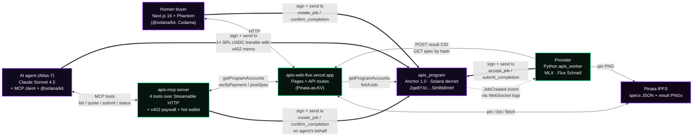
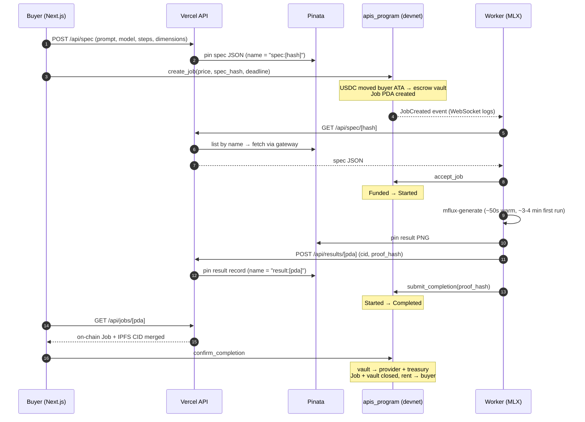
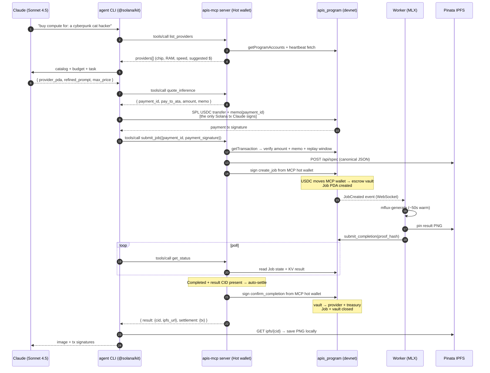
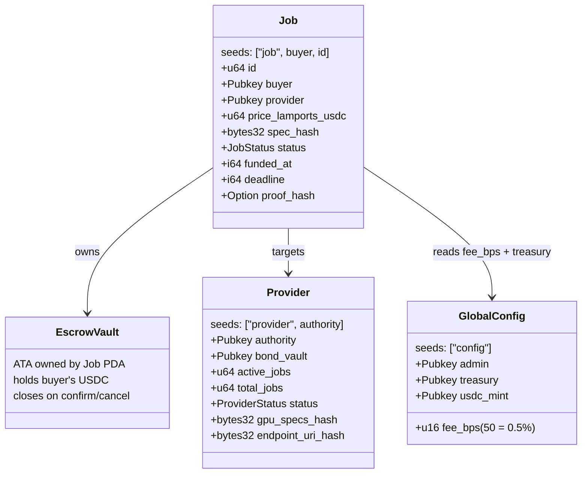

# Apis

**A permissionless GPU compute marketplace on Solana.**

Pay USDC, get IPFS results, settled on-chain via an open Anchor program.
No accounts, no middleman, no vendor lock-in. Buyers post jobs, registered
workers pick them up, escrow releases on proof of completion.

Four surfaces, one program:

- **Buyer web app** at `apis-web-five.vercel.app` — browse providers
  with live hardware specs, submit jobs, watch them run, settle on-chain.
- **Provider desktop app** (Tauri / macOS) — onboard, run benchmarks,
  publish signed liveness heartbeats with chip / RAM / speed / price,
  monitor earnings + GPU utilization, auto-pause when other apps need
  the GPU.
- **MCP server** with **x402 paywall** — exposes the marketplace as
  four MCP tools (`list_providers`, `quote_inference`, `submit_job`,
  `get_status`). Agents pay via HTTP 402-style SPL USDC transfers; the
  server signs all on-chain instructions on their behalf.
- **Atlas-7 autonomous agent** — Claude Sonnet 4.5 in a tool-use loop,
  reads the live network, picks a provider, refines the prompt, pays
  via x402, downloads the result. Zero human in the loop.
---

## Live demo + on-chain addresses

| | |
|---|---|
| **Live web app** | <https://apis-web-five.vercel.app> |
| **MCP server** | local-only at v0.4.0 — `http://localhost:3030/mcp` after `pnpm --filter @apis/mcp dev`. Fly.io deploy queued for v0.4.1. |
| **Atlas-7 agent CLI** | `pnpm --filter agent buy "..." --mcp http://localhost:3030/mcp` |
| **Demo video (≤ 3 min)** | https://drive.google.com/file/d/1Ve944QlXY6CNj4oRqKGkLRuobA8KF9Gi/view?usp=sharing |
| **GitHub** | <https://github.com/hu-oscar/Apis> |
| | |
| Anchor program | [`2qe8YXciSpony5vjwxZAYJZ7WfRzSHKRdRzSiH868mhf`](https://explorer.solana.com/address/2qe8YXciSpony5vjwxZAYJZ7WfRzSHKRdRzSiH868mhf?cluster=devnet) |
| GlobalConfig PDA | [`CUMeUgPvQNiuc9Th93DD1czTUdEeDR9FCABoN6gyGPg2`](https://explorer.solana.com/address/CUMeUgPvQNiuc9Th93DD1czTUdEeDR9FCABoN6gyGPg2?cluster=devnet) |
| Test USDC mint | [`8Lmkrhbc4du7VD7qsK2xGQj3vCqVjvDdRVjFimg6jNsS`](https://explorer.solana.com/address/8Lmkrhbc4du7VD7qsK2xGQj3vCqVjvDdRVjFimg6jNsS?cluster=devnet) |
| Reference worker (Provider PDA) | [`4hhpQuy559Ky427pGianWckXC6BTW5tkWAbRn2qvauEA`](https://explorer.solana.com/address/4hhpQuy559Ky427pGianWckXC6BTW5tkWAbRn2qvauEA?cluster=devnet) |
| Treasury | [`AocVgNfUByYHhipazTLPCUdfnAbDiJQz4mE3BBBL6649`](https://explorer.solana.com/address/AocVgNfUByYHhipazTLPCUdfnAbDiJQz4mE3BBBL6649?cluster=devnet) |
| Deployment cluster | Solana **devnet** |
| Anchor version | **1.0.2** |

A reference end-to-end job that ran on devnet, driven by a Phantom
buyer through the live `/submit` page. The Job's tx history on
Solana Explorer shows all four lifecycle transactions —
`create_job` → `accept_job` → `submit_completion` → `confirm_completion`.

<p align="center">
  
</p>

> **"an astronaut riding a horse on Mars, photorealistic, golden hour"**
> · Flux Schnell · 4-step · 512×512 · MLX on M3 Pro
> · pinned to IPFS (CID `bafybeih…jn4gfuq`)
> · settled on Solana devnet — provider got paid 0.995 USDC,
>   treasury 0.005 USDC, vault closed, rent refunded to the buyer.
> End-to-end pipeline: **~56 seconds**.

---

## Try it in 2 minutes (for judges)

Two demos, depending on what you want to evaluate.

### **A. Buyer flow** (human-driven, no setup)

1. Switch **Phantom** to devnet (Settings → Developer Settings → Testnet Mode
   ON → network: Devnet). Or any Solana wallet that supports devnet.
2. Open <https://apis-web-five.vercel.app>. Click **Connect wallet** top-right.
3. Navigate to **submit**. If your wallet shows `0 USDC`, click **Get 10
   USDC** — Apis faucets test-mint USDC to your ATA in ~3s. (Falls back
   to `/network` if the form prompts you for a provider — click "Use
   this provider" on the live row.)
4. Type a prompt, leave the rest at defaults, click **Submit job**. Phantom
   prompts → approve. Page redirects to `/job/[id]`.
5. Watch the pipeline: Funded → Started → Completed (~60s on the reference
   M3 Pro worker). Click **Confirm & release USDC**. Phantom approves the
   settlement tx, the result image displays, your wallet's USDC drops
   by the job price.

While you're there: peek at **/stats** for live network telemetry,
**/network** for a list of providers with their published hardware,
**/history** for the jobs your wallet has submitted (works across
sessions via per-wallet localStorage), and **/provider/[pda]** for a
provider's profile with chip / RAM / Flux speed / suggested price.

### **B. Autonomous agent flow** (Atlas-7 = Claude buying compute on its own)

Local-only, three terminals:

```bash
# Terminal 1 — MCP server (binds to localhost:3030)
APIS_MCP_SERVER_KEYPAIR_JSON="$(cat ~/.config/solana/id.json)" \
  pnpm --filter @apis/mcp dev

# Terminal 2 — provider desktop app (Tauri window opens)
pnpm --filter apis-provider tauri dev

# Terminal 3 — Atlas-7 runs the autonomous purchase
export ANTHROPIC_API_KEY=sk-ant-…
export APIS_MCP_URL=http://localhost:3030/mcp
pnpm --filter agent buy "a cyberpunk cat hacker, neon rain" --budget 0.10
```

Claude reads `list_providers` over MCP, picks one, refines the prompt,
asks for a `quote_inference` (which returns an x402 payment block),
signs + sends a single SPL USDC transfer with the quote's memo, then
calls `submit_job` with the payment signature. The MCP server verifies
the on-chain payment, signs `create_job` on Claude's behalf, polls,
auto-signs `confirm_completion` when the result lands. Total ~60s end
to end, ~1 USDC paid, one Solana tx ever signed by Claude (the
payment).

---

**Two cryptographic primitives tie the four surfaces together:**

- **Signed liveness heartbeats** — worker Ed25519-signs every
  heartbeat with its on-chain `Provider.authority` key, Vercel
  verifies the signature + matches it to chain before persisting the
  enriched payload to KV. Buyer pages read it back — so the chip and
  benchmark you see on `/network` are cryptographically attested by
  the provider's actual keypair, not a self-reported label. See
  `packages/worker/apis_worker/heartbeat.py` and
  `packages/web/app/api/heartbeat/[pda]/route.ts`.
- **x402-style payment receipts** — Atlas-7 pays the MCP server via a
  single SPL USDC transfer carrying the server-issued `payment_id` as
  its memo. The server walks the on-chain tx (`getTransaction` with
  `jsonParsed` encoding), verifies amount + recipient + memo + replay
  window before executing `create_job` on the agent's behalf. The
  agent never signs an apis_program instruction; the MCP server is
  the only on-chain actor. See `packages/mcp/src/lib/payment.ts` and
  `packages/agent/src/lib/payment-tx.ts`.

---

## What is Apis?

Centralized AI cloud (Replicate, Fal, vendor X) gives you compute, but you
trade off:

- An account, KYC, a credit card, and a single point of failure.
- Opaque pricing and no exit cost.
- Trust the operator to actually run what they say they ran.

**Apis is the marketplace alternative.** A buyer with a Solana wallet posts
a job (prompt + price). A registered provider runs the inference, uploads
the result to IPFS, and posts a proof hash on-chain. The buyer confirms,
escrow releases, vault closes. Payment is USDC, settlement is on-chain,
provider set is permissionless.

The hackathon MVP runs on Solana devnet and uses **Flux Schnell** (Apache
2.0) on **Apple Silicon** (MLX) as the reference inference workload.

---

## Architecture

Four coupled clients, one Anchor program, three external services. The
program is the only piece that has to be trusted; everything else is
swappable. Buyers come in two flavors: humans through the web app, or
AI agents through the MCP server.



The thick arrows are signed Solana transactions. The dotted arrow is an
Anchor `emit!` event the worker subscribes to via `logsSubscribe`.

### Why this split?

- **Browser ↔ program directly**: `create_job` and `confirm_completion`
  are signed by the buyer's wallet, never proxied. Vercel never holds a
  buyer's keys.
- **Worker ↔ program directly**: same for `accept_job` and
  `submit_completion` — signed by the worker's local keypair, the
  Vercel API never relays them.
- **Agent → MCP → program**: the agent doesn't sign apis_program txs
  at all. It pays the MCP server via a single SPL transfer with an
  x402 memo; the server verifies on chain, then signs `create_job` +
  `confirm_completion` from its own hot wallet. Trade-off: judges
  can ask "but what if the MCP server is malicious?" — answer is yes,
  the server can frontrun or grief, which is why the buyer-direct
  path stays the primary one. Agent-mode is for autonomous use cases
  where wallet management isn't viable.
- **Vercel as a side-channel only**: it serves the UI, it brokers
  off-chain JSON (specs, result CIDs) via Pinata, and it runs a small
  USDC faucet for hackathon judges. It has no privileged role.
- **Pinata as both pinner and KV**: serves dual duty — actual IPFS
  pinning for the result PNG, plus a `name`-indexed key-value store for
  the buyer↔worker side-channel JSON. One vendor, two uses, free tier.

### Signed heartbeats

Every 30s the worker posts a heartbeat to Vercel:

```jsonc
{
  "payload": {
    "at": 1778537716009,
    "version": "0.3.0",
    "capacity": 1,
    "chip": "Apple M3 Pro",
    "ramGb": 18,
    "cpuCores": 11,
    "secondsPerImage": "271.040",
    "suggestedPriceUsdcBase": "75289"
  },
  "signature": "<base58, 64 bytes>",   // Ed25519(canonical_json(payload))
  "publicKey": "<base58, 32 bytes>"
}
```

The Vercel route does four checks before persisting (replay window ±5min,
ed25519 signature verify via `tweetnacl`, on-chain `Provider.authority`
lookup, publicKey == authority match). The buyer pages then surface the
chip / speed / suggested price on `/network`, `/provider/[pda]`, and
`/stats` — knowing they were attested by the keypair that registered
the provider on-chain.

The canonical JSON encoder is byte-identical across Python and JS
(strings only — `secondsPerImage` is a decimal string, not a float,
to avoid `json.dumps(12.0)` → `"12.0"` vs `JSON.stringify(12.0)` →
`"12"` disagreement). End-to-end interop verified with a deterministic-
keypair smoke test.

---

## Job lifecycle

A buyer posts a job, a worker runs it, the buyer confirms. End-to-end
warm latency is ~60 seconds on M3 Pro for a 512² Flux Schnell job.



If a worker doesn't accept within the deadline, the buyer can call
`cancel_job` for a full refund — wired to the **Cancel & refund** button
on `/job/[id]`'s Funded-state card, with a live deadline countdown
("expires in 4m 32s") that turns amber under one minute. The program
also has `submit_completion` gating: only the registered provider's
`authority` can post a proof for a job that targets it.

---

## Agent + MCP + x402 lifecycle

Same on-chain flow as above, different actor on the buyer side.
Atlas-7 (Claude) never signs an apis_program instruction — it pays
the MCP server via a single SPL transfer + memo, and the server
signs `create_job` + `confirm_completion` on its behalf.



The x402 paywall is enforced by `submit_job`: without a valid
`payment_signature` that points at an on-chain SPL transfer
matching the quote, the server refuses to sign `create_job`. The
verification logic walks the `jsonParsed` tx → finds the SPL Token
transfer to the server's USDC ATA → checks amount + memo + the
±5min replay window. Same security shape as Coinbase x402, but
self-rolled (no external facilitator dependency).

---

## On-chain accounts



`JobStatus`: `Created → Funded → Started → Completed → (closed by
confirm_completion)`. Failure paths: `Refunded` (cancelled) and `Slashed`
(deadline missed; in W3+ would slash provider bond).

The program ships with **20 bankrun tests** — at least one happy-path and
one malicious-input test per instruction (insufficient balance, wrong
mint, double-accept, post-deadline confirm, wrong provider authority,
etc.).

---

## Solana SDKs in use

### Anchor program (Rust)

| Library | Use |
|---|---|
| `anchor-lang` 1.0.2 | Account macros, PDA seeds, `emit!` events, `close = buyer` |
| `anchor-spl` 1.0.2 | `Token`, `Mint`, `TokenAccount`, `transfer_checked`, `init_if_needed` |
| `solana-program` | Low-level types, sysvars |

### Web app (TypeScript / Next.js 16)

| Library | Use |
|---|---|
| `@solana/kit` 6.x | Wallet signers, RPC client, transaction message builders, base58/base64 codecs, PDA derivation |
| `@solana/client` | Application-level wallet bridge for `useWalletConnection` |
| `@solana/react-hooks` | `useWalletConnection`, `useSolanaClient`, `useSendTransaction`, `useWalletSession` |
| `@solana-program/token` | `getMintToInstruction`, `getCreateAssociatedTokenIdempotentInstructionAsync` (faucet) |
| `codama` + `@codama/nodes-from-anchor` + `@codama/renderers-js` | IDL → typed TS client (instruction builders, account fetchers, PDA helpers, error parsers) |
| `tweetnacl` + `bs58` | Ed25519 signature verification on incoming worker heartbeats (`/api/heartbeat/[pda]` POST) |

The TS client is regenerated on every program rebuild via `pnpm
codama:generate` — typed `getCreateJobInstructionAsync`,
`getConfirmCompletionInstructionAsync`, `fetchMaybeJob`,
`fetchAllProvider`, `findProviderPda`, etc. all come from the on-chain
IDL. No hand-rolled discriminators on the web side.

### Worker (Python 3.12)

| Library | Use |
|---|---|
| `solders` 0.26+ | Keypair, Pubkey, Instruction, MessageV0, VersionedTransaction. Also signs every heartbeat with the worker authority key. |
| `solana` 0.36+ | `AsyncClient`, `connect()` for WebSocket logs subscription, `TxOpts` |
| `borsh-construct` | Anchor event decoders (mirrors `programs/apis_program/src/events.rs`) |
| `websockets` | Auto-reconnecting `logsSubscribe` loop with exponential backoff |
| `httpx` | Pinata uploads + Vercel API calls (specs, results, signed heartbeats) |
| `mflux` 0.17 + `mlx` | Flux Schnell inference on Apple Silicon (Metal-backed) |
| `python-dotenv` | Load `packages/worker/.env` |
| `Pillow`, `imagehash` | Result post-processing |

Anchor 1.0's IDL format isn't supported by `anchorpy` 0.21 yet, so the
worker uses static borsh layouts + IDL-derived discriminators directly.

### Desktop provider app (Rust + React, Tauri 2)

| Library | Use |
|---|---|
| `tauri` 2 (with `tray-icon` + `image-png` features) | macOS-native window + menu-bar tray icon, four-state hex glyph (active green / paused amber / error red / inactive gray) |
| `tauri-plugin-store` | Persistent KV for settings (HF token, Pinata JWT, API base, keypair path) + the local 100-job earnings ledger |
| `tauri-plugin-opener` | Surfacing tx links on Solana Explorer |
| `tokio` (process, io-util, sync, macros) | Worker subprocess lifecycle, line-by-line log streaming |
| React 19 + `framer-motion` | The dashboard UI (provider PDA card, earnings, benchmark, GPU monitor, recent jobs) |

The desktop app spawns the Python worker as a child process, forwards
HuggingFace + Pinata + API-base credentials via env, and additionally
publishes the detected hardware + most-recent Flux benchmark + the
fair-tier suggested price (`APIS_PROVIDER_CHIP`,
`APIS_PROVIDER_RAM_GB`, `APIS_PROVIDER_CPU_CORES`,
`APIS_BENCHMARK_SECONDS_PER_IMAGE`, `APIS_SUGGESTED_PRICE_USDC_BASE`).
The worker bakes those into every signed heartbeat. macOS-only at v0.3.

### MCP server (TypeScript, Express)

| Library | Use |
|---|---|
| `@modelcontextprotocol/sdk` 1.29 | `McpServer`, `StreamableHTTPServerTransport`, tool registration (`server.registerTool`), session lifecycle via `mcp-session-id` headers |
| `express` 4 | HTTP transport for the MCP endpoint + `/health` + landing page. Cleaner integration with the SDK's `IncomingMessage` / `ServerResponse` API than Hono. |
| `@solana/kit` 6.x | Server-side keypair signing of `create_job` + `confirm_completion` on the agent's behalf, RPC client, blockhash lifetime, tx serialization |
| `@solana-program/token` | (transitive) Token Program account ATA derivation |
| `zod` 3.x | Tool input schema validation — invalid args bounce back as MCP errors before any RPC call |

Server hot wallet lives at `~/.config/apis/mcp-server.json` (file)
OR in the `APIS_MCP_SERVER_KEYPAIR_JSON` env var (Fly.io-friendly).
Needs ~0.1 SOL float + ~5 USDC float per active job. The x402
verifier uses `rpc.getTransaction({encoding: "jsonParsed"})` which
returns SPL token transfers + memo instructions as structured data
— no manual borsh decoding of token instructions.

### Atlas-7 agent (TypeScript, Claude Sonnet 4.5)

| Library | Use |
|---|---|
| `@anthropic-ai/sdk` 0.95 | Claude as the decision-maker — picks a provider, refines the prompt, sets a budget. Returns structured JSON; the agent validates the chosen `provider_pda` is in the catalog before signing anything. |
| `@modelcontextprotocol/sdk` 1.29 | MCP client + `StreamableHTTPClientTransport` for the `--mcp` mode. Thin typed wrapper around tool calls. |
| `@solana/kit` 6.x + `@solana-program/token` | Build + sign the x402 payment tx — one versioned tx with two instructions (SPL `TransferChecked` + a memo program call carrying the server-issued `payment_id`). |

The agent has two operational modes:

- **Direct Solana** (default): Atlas-7's keypair signs `create_job`
  + `confirm_completion` directly. No MCP, no x402, no server in
  the loop. Faster, fewer moving parts; useful when there's no MCP
  server reachable.
- **MCP + x402** (`--mcp <url>` or `APIS_MCP_URL` env): the agent
  signs only one Solana tx — the SPL USDC transfer to the MCP
  server's ATA. The server signs everything on-chain. 

### Solana CLI tooling

`solana`, `spl-token`, `anchor`, `@solana-program/program-metadata` (for
on-chain IDL upload — Anchor 1.0's `idl init`/`upgrade` doesn't handle
size growth gracefully).

---

## Repo layout

```
Apis/
├── packages/
│   ├── program/             # Anchor 1.0 program (Rust)
│   │   ├── programs/apis_program/src/
│   │   │   ├── instructions/    # 7 instructions
│   │   │   ├── state/           # GlobalConfig, Provider, Job
│   │   │   └── events.rs        # JobCreated, ProviderRegistered
│   │   └── tests/               # 20 bankrun tests
│   │
│   ├── web/                 # Next.js 16 + React 19 marketplace
│   │   ├── app/
│   │   │   ├── page.tsx                     # landing (live stats)
│   │   │   ├── network/page.tsx             # provider + job browse
│   │   │   ├── provider/[pda]/page.tsx      # provider profile + hardware
│   │   │   ├── submit/page.tsx              # buyer flow
│   │   │   ├── job/[id]/page.tsx            # status + image + confirm + cancel
│   │   │   ├── stats/page.tsx               # network telemetry + north star
│   │   │   ├── history/page.tsx             # wallet-scoped past jobs
│   │   │   ├── not-found.tsx + error.tsx    # branded chrome
│   │   │   ├── api/spec/                    # buyer→worker side-channel
│   │   │   ├── api/results/[pda]/           # worker→buyer side-channel
│   │   │   ├── api/heartbeat/[pda]/         # signed liveness + hardware
│   │   │   ├── api/jobs/[pda]/              # combined chain + KV view
│   │   │   ├── api/faucet/                  # test USDC drip
│   │   │   └── lib/
│   │   │       ├── apis-program.ts          # Codama-generated client
│   │   │       ├── heartbeat-client.ts      # signed heartbeat reader
│   │   │       ├── pinata-store.ts          # Pinata-as-KV primitive
│   │   │       └── kv.ts                    # KV abstraction
│   │   └── DEPLOY.md                        # Vercel runbook
│   │
│   ├── worker/              # Python provider runtime
│   │   ├── apis_worker/
│   │   │   ├── listener.py                  # logsSubscribe + dispatch
│   │   │   ├── inference.py                 # mflux subprocess wrapper
│   │   │   ├── ipfs.py                      # Pinata v3 upload
│   │   │   ├── submit.py                    # accept_job + submit_completion
│   │   │   ├── heartbeat.py                 # signed liveness + hardware
│   │   │   ├── benchmark.py                 # one-shot mflux timer (CLI)
│   │   │   ├── spec_channel.py              # dual-mode (HTTP / FS)
│   │   │   ├── result_channel.py            # dual-mode (HTTP / FS)
│   │   │   └── decoder.py                   # event borsh layouts
│   │   └── scripts/
│   │       ├── bootstrap_devnet.py          # idempotent mint + config init
│   │       ├── bootstrap_keypair.py         # worker keypair creation
│   │       ├── register_provider.py         # one-shot Provider PDA reg
│   │       ├── test_create_job.py           # buyer-side e2e
│   │       └── test_confirm_job.py          # buyer-side settlement
│   │
│   ├── apis-provider/       # Tauri 2 desktop app (macOS, F1)
│   │   ├── src-tauri/
│   │   │   ├── src/
│   │   │   │   ├── lib.rs                   # Builder, setup, command registry
│   │   │   │   ├── worker.rs                # subprocess lifecycle + log stream
│   │   │   │   ├── tray.rs                  # menu-bar tray + 4 state icons
│   │   │   │   ├── gpu_monitor.rs           # ioreg-based GPU % sampler
│   │   │   │   ├── hw_detect.rs             # sysctl chip / RAM / cores
│   │   │   │   └── benchmark.rs             # spawns apis_worker.benchmark
│   │   │   ├── icons/tray/                  # active/paused/error/inactive PNGs
│   │   │   └── Cargo.toml                   # tauri features: tray-icon, image-png
│   │   └── src/                              # React dashboard
│   │       ├── App.tsx                       # main shell
│   │       ├── lib/settings.ts               # Tauri Store settings + autoPause
│   │       ├── lib/job-history.ts            # persistent earnings ledger
│   │       ├── lib/gpu-monitor.ts            # rolling-avg hook
│   │       ├── lib/benchmark.ts              # detectHardware + runBenchmark
│   │       └── components/Onboarding.tsx     # first-launch 3-step wizard
│   │
│   ├── mcp/                 # MCP server 
│   │   ├── src/
│   │   │   ├── index.ts                     # Express + StreamableHTTPServerTransport
│   │   │   ├── server.ts                    # McpServer + 4 tool registrations
│   │   │   ├── generated/apis-program/      # Codama-generated client 
│   │   │   └── lib/
│   │   │       ├── rpc.ts                   # constants + RPC + USDC formatter
│   │   │       ├── network.ts               # fetchProviders + heartbeats
│   │   │       ├── spec.ts                  # canonical-JSON hash + POST
│   │   │       ├── server-wallet.ts         # MCP hot wallet loader
│   │   │       ├── onchain.ts               # create_job + confirm_completion
│   │   │       └── payment.ts               # x402 self-roll verifier
│   │   └── README.md                        # tool surface + curl tests
│   │
│   └── agent/               # Atlas-7 autonomous Claude buyer 
│       ├── src/
│       │   ├── index.ts                     # CLI: direct-Solana or --mcp mode
│       │   ├── generated/apis-program/      # Codama-generated client (copied)
│       │   └── lib/
│       │       ├── wallet.ts                # ~/.config/apis/agent.json
│       │       ├── network.ts               # fetch + pickProvider
│       │       ├── decide.ts                # decideWithClaude / Deterministic
│       │       ├── spec.ts                  # canonical-JSON + sha256
│       │       ├── submit.ts                # create_job (direct mode)
│       │       ├── watch.ts                 # poll /api/jobs (direct mode)
│       │       ├── confirm.ts               # confirm_completion (direct mode)
│       │       ├── mcp-client.ts            # @mcp/sdk client + typed tool helpers
│       │       ├── payment-tx.ts            # SPL transfer + memo for x402
│       │       ├── download.ts              # IPFS PNG → ./out/
│       │       └── format.ts                # ANSI step()/indent()/rule()
│       └── README.md
│
├── docs/                    # research, PRD, tech design (v1)
├── AGENTS.md                # engineering rules + agent posture
├── MEMORY.md                # decision log + active state
└── README.md                # this file
```

---

## Local setup

### Prerequisites

- **Rust** + **Solana CLI** (3.1.8+) + **Anchor** 1.0.2 (`avm install 1.0.2`)
- **Node.js** 20+ + **pnpm** 10
- **Python** 3.12 + venv
- **Mac with Apple Silicon** for the worker + desktop app (the reference
  inference backend uses MLX; the desktop app's hardware-detection +
  GPU-monitor paths shell out to `sysctl` and `ioreg`). The program + web
  app run anywhere.
- **Phantom wallet** browser extension on devnet
- A **Pinata** account with a JWT (Files: Write scope) — free tier is fine
- A **HuggingFace** account + token, with the FLUX.1-schnell repo terms
  accepted (gated repo)

### 1. Clone + install

```bash
git clone https://github.com/hu-oscar/Apis
cd Apis
pnpm install
```

### 2. Build the program (optional — already deployed)

The program is already deployed on devnet at the address above. To rebuild:

```bash
cd packages/program
anchor build
anchor test    # 20/20 bankrun tests pass
```

To regenerate the typed TS client (required after any IDL change):

```bash
cd packages/web
pnpm codama:generate
```

### 3. Bootstrap devnet (idempotent)

This creates the test USDC mint, initializes `GlobalConfig`, and funds
the deployer's ATA. Re-run any time without side effects.

```bash
cd packages/worker
python -m venv .venv && .venv/bin/pip install -e .
.venv/bin/python scripts/bootstrap_devnet.py
```

### 4. Run the worker

Configure `packages/worker/.env`:

```
PINATA_JWT=eyJ...                 # required
HF_TOKEN=hf_...                   # required (Flux Schnell is gated on HF)
# APIS_API_BASE=https://...       # set to your Vercel URL when running
                                  #   against the deployed app
```

Generate + register the worker's Provider PDA, then start the listener:

```bash
.venv/bin/python scripts/bootstrap_keypair.py    # creates ~/.config/apis/worker.json
solana transfer <worker-pubkey> 0.05 --url devnet --allow-unfunded-recipient
.venv/bin/python scripts/register_provider.py    # registers Provider PDA
HF_HUB_ENABLE_HF_TRANSFER=1 .venv/bin/python -m apis_worker
```

Expected: `subscribed (id=…); waiting for jobs…`

### 5. Run the web app

```bash
pnpm --filter web dev
# open http://localhost:3000
```

Connect Phantom (devnet), submit a job, watch it land. The web's API
routes fall back to `/tmp/apis_kv/` when `PINATA_JWT` is unset, so
local-only dev needs no Pinata.

### 6. Run the desktop provider app (optional — replaces step 4 for a richer experience)

The Tauri desktop app spawns the same `apis_worker` Python process you
run in step 4, but adds: a system-tray indicator, the signed-heartbeat
hardware metadata (chip / RAM / Flux speed / suggested price), an
earnings ledger persisted across restarts, GPU-contention auto-pause,
and a one-click in-app Flux Schnell benchmark.

```bash
pnpm --filter apis-provider tauri dev   # opens a macOS window
```

First boot is ~30s (Rust shell compile). Once the window opens:

1. Click ⚙ top-right → fill in HF token, Pinata JWT, API base
   (`http://localhost:3000` for local or `https://apis-web-five.vercel.app`
   for prod). Set Python interpreter to the absolute path of your
   `packages/worker/.venv/bin/python`, and Working dir to your
   `packages/worker`.
2. Save → close the drawer.
3. (Optional) Click **Run benchmark** to measure your Flux speed.
4. Toggle **OFFLINE → ONLINE** top-right. Worker subprocess spawns,
   signed heartbeats start flowing.

The tray icon turns green; left-click brings the window forward,
right-click for Pause/Resume/Quit. Closing the window hides it instead
of killing the worker — quit via the tray menu when you're done.

To build a distributable `.app` + `.dmg` (unsigned, devnet only):

```bash
pnpm --filter apis-provider tauri build
# bundle output: packages/apis-provider/src-tauri/target/release/bundle/
```

See `packages/apis-provider/BUILD.md` for Gatekeeper workarounds when
distributing the unsigned bundle.

### 7. Run the MCP server (F4 agent rail)

The MCP server exposes the marketplace as four tools (`list_providers`,
`quote_inference`, `submit_job`, `get_status`) over Streamable HTTP.
Agents call these instead of touching the Solana program directly.
`submit_job` is x402-paywalled — agents must pay the server in USDC
(via a single SPL transfer with a server-issued memo) before it will
sign `create_job` on their behalf.

The server needs its own hot wallet, funded with:
- ~0.1 SOL for tx fees (devnet airdrop is fine)
- ≥ 5 USDC float for in-flight job escrow

```bash
# Option A — keypair file
solana-keygen new --outfile ~/.config/apis/mcp-server.json
SERVER_PUBKEY=$(solana address --keypair ~/.config/apis/mcp-server.json)
solana transfer "$SERVER_PUBKEY" 0.1 --url devnet --allow-unfunded-recipient
cd packages/worker && .venv/bin/python scripts/bootstrap_devnet.py \
  --fund "$SERVER_PUBKEY" --amount 10

pnpm --filter @apis/mcp dev
# → listening on http://0.0.0.0:3030

# Option B — env-var keypair (Fly.io-friendly; keep the file off disk)
export APIS_MCP_SERVER_KEYPAIR_JSON="$(cat ~/.config/apis/mcp-server.json)"
pnpm --filter @apis/mcp dev
```

Sanity-check the server with curl or the MCP Inspector:

```bash
# Direct curl
curl -s http://localhost:3030/health
npx @modelcontextprotocol/inspector http://localhost:3030/mcp
```

See `packages/mcp/README.md` for the full tool surface + a curl-only
smoke test that exercises initialize → tools/list → list_providers.

### 8. Run Atlas-7 (the autonomous Claude buyer)

The agent CLI lives in `packages/agent/`. Two modes:

```bash
# One-time: generate the agent's keypair + fund it
pnpm --filter agent buy --bootstrap-wallet
# → prints "pubkey: <ADDRESS>"
solana transfer <ADDRESS> 0.05 --url devnet --allow-unfunded-recipient
cd packages/worker && .venv/bin/python scripts/bootstrap_devnet.py \
  --fund <ADDRESS> --amount 10
```

Then:

```bash
export ANTHROPIC_API_KEY=sk-ant-…

# Mode 1 — direct Solana (no MCP)
pnpm --filter agent buy "a cyberpunk cat hacker, neon rain"
# → agent signs create_job + confirm_completion itself

# Mode 2 — MCP + x402 (the full autonomous agent demo)
export APIS_MCP_URL=http://localhost:3030/mcp
pnpm --filter agent buy "a cyberpunk cat hacker, neon rain" --budget 0.10
# → agent signs ONE Solana tx (the USDC payment with x402 memo);
#   MCP server signs create_job + confirm_completion on its behalf
```

Useful flags: `--budget 0.10` (USDC cap), `--skip-claude` (use a
deterministic provider pick + raw prompt — no Anthropic API needed),
`--model claude-opus-4-5` (for demo recordings), `--dry-run` (plan
but don't submit).

See `packages/agent/README.md` for the agent's internals.

---

## License

MIT. See individual `Cargo.toml` / `package.json` for sub-package
licenses (all permissive: MIT / Apache-2.0). Flux Schnell is Apache-2.0;
Anchor is Apache-2.0; Pinata SDKs are MIT.

Devnet only.
