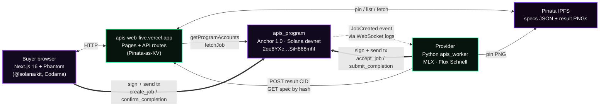
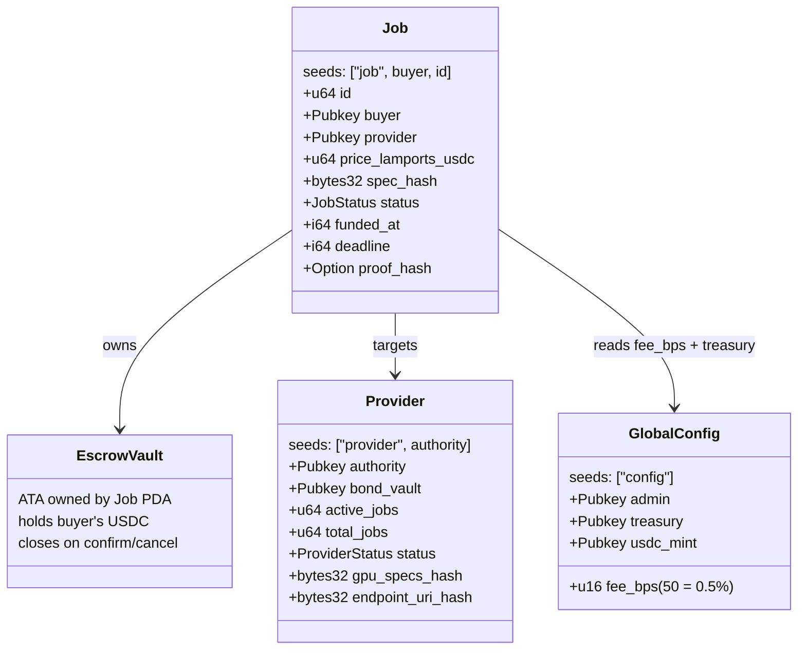

# Apis

**A permissionless GPU compute marketplace on Solana.**

Pay USDC, get IPFS results, settled on-chain via an open Anchor program.
No accounts, no middleman, no vendor lock-in. Buyers post jobs, registered
workers pick them up, escrow releases on proof of completion.

> Submitted to **Dev3pack hackathon — Solana track ($10k pool)**.

---

## Live demo + on-chain addresses

| | |
|---|---|
| **Live web app** | <https://apis-web-five.vercel.app> |
| **Demo video (≤ 3 min)** | _to be added in W5 polish_ |
| **GitHub** | <https://github.com/hu-oscar/Apis> |
| | |
| Anchor program | [`2qe8YXciSpony5vjwxZAYJZ7WfRzSHKRdRzSiH868mhf`](https://explorer.solana.com/address/2qe8YXciSpony5vjwxZAYJZ7WfRzSHKRdRzSiH868mhf?cluster=devnet) |
| GlobalConfig PDA | [`CUMeUgPvQNiuc9Th93DD1czTUdEeDR9FCABoN6gyGPg2`](https://explorer.solana.com/address/CUMeUgPvQNiuc9Th93DD1czTUdEeDR9FCABoN6gyGPg2?cluster=devnet) |
| Test USDC mint | [`8Lmkrhbc4du7VD7qsK2xGQj3vCqVjvDdRVjFimg6jNsS`](https://explorer.solana.com/address/8Lmkrhbc4du7VD7qsK2xGQj3vCqVjvDdRVjFimg6jNsS?cluster=devnet) |
| Reference worker (Provider PDA) | [`4hhpQuy559Ky427pGianWckXC6BTW5tkWAbRn2qvauEA`](https://explorer.solana.com/address/4hhpQuy559Ky427pGianWckXC6BTW5tkWAbRn2qvauEA?cluster=devnet) |
| Treasury | [`AocVgNfUByYHhipazTLPCUdfnAbDiJQz4mE3BBBL6649`](https://explorer.solana.com/address/AocVgNfUByYHhipazTLPCUdfnAbDiJQz4mE3BBBL6649?cluster=devnet) |
| Deployment cluster | Solana **devnet** |
| Anchor version | **1.0.2** |

A reference end-to-end job that ran on devnet during W2-Step-3 Phase G
(driven by a Phantom buyer through the live `/submit` page). The Job's
tx history shows all four lifecycle transactions:

[`Job Dn4dd3ByZZT5CPVw9JncUpQsoDjjtaQBGKjV7d3czX4h`](https://explorer.solana.com/address/Dn4dd3ByZZT5CPVw9JncUpQsoDjjtaQBGKjV7d3czX4h?cluster=devnet)
— `create_job` → `accept_job` → `submit_completion` → `confirm_completion`.

Settled image on IPFS:
[`bafybeigdbaytn4kw7x2lkfti6zxprvt44zwikcmg3r2u7lqqe7qhhcvdx4`](https://gateway.pinata.cloud/ipfs/bafybeigdbaytn4kw7x2lkfti6zxprvt44zwikcmg3r2u7lqqe7qhhcvdx4)
— "an astronaut riding a horse on Mars, photorealistic, golden hour",
512×512, Flux Schnell 4-step on M3 Pro, end-to-end pipeline ~56 s.

---

## What is this?

Centralized AI cloud (Replicate, Fal, vendor X) gives you compute, but you
trade off:

- An account, KYC, a credit card, and a single point of failure.
- Opaque pricing and no exit cost.
- Trust the operator to actually run what they say they ran.

**Apis is the marketplace alternative.** A buyer with a Solana wallet posts
a job (prompt + price). A registered provider runs the inference, uploads
the result to IPFS, and posts a proof hash on-chain. The buyer confirms,
escrow releases, vault closes. Payment is USDC, settlement is on-chain,
provider set is permissionless.

The hackathon MVP runs on Solana devnet and uses **Flux Schnell** (Apache
2.0) on **Apple Silicon** (MLX) as the reference inference workload.

---

## Architecture

Three coupled components, three external services. The Anchor
program is the only piece that has to be trusted; everything else is
swappable.



The thick arrows are signed Solana transactions. The dotted arrow is an
Anchor `emit!` event the worker subscribes to via `logsSubscribe`.

### Why this split?

- **Browser ↔ program directly**: `create_job` and `confirm_completion`
  are signed by the buyer's wallet, never proxied. Vercel never holds a
  buyer's keys.
- **Worker ↔ program directly**: same for `accept_job` and
  `submit_completion` — signed by the worker's local keypair, the
  Vercel API never relays them.
- **Vercel as a side-channel only**: it serves the UI, it brokers
  off-chain JSON (specs, result CIDs) via Pinata, and it runs a small
  USDC faucet for hackathon judges. It has no privileged role.
- **Pinata as both pinner and KV**: serves dual duty — actual IPFS
  pinning for the result PNG, plus a `name`-indexed key-value store for
  the buyer↔worker side-channel JSON. One vendor, two uses, free tier.

---

## Job lifecycle

A buyer posts a job, a worker runs it, the buyer confirms. End-to-end
warm latency is ~60 seconds on M3 Pro for a 512² Flux Schnell job.

```mermaid
sequenceDiagram
  autonumber
  participant B as Buyer (Next.js)
  participant V as Vercel API
  participant P as Pinata
  participant A as apis_program (devnet)
  participant W as Worker (MLX)

  B->>V: POST /api/spec (prompt, model, steps, dimensions)
  V->>P: pin spec JSON (name = "spec:&lt;hash&gt;")
  B->>A: create_job(price, spec_hash, deadline)
  Note over A: USDC moved buyer ATA → escrow vault<br/>Job PDA created
  A-->>W: JobCreated event (WebSocket logs)
  W->>V: GET /api/spec/&lt;hash&gt;
  V->>P: list by name → fetch via gateway
  V-->>W: spec JSON
  W->>A: accept_job
  Note over A: Funded → Started
  W->>W: mflux-generate (~50s warm, ~3-4 min first run)
  W->>P: pin result PNG
  W->>V: POST /api/results/&lt;pda&gt; (cid, proof_hash)
  V->>P: pin result record (name = "result:&lt;pda&gt;")
  W->>A: submit_completion(proof_hash)
  Note over A: Started → Completed
  B->>V: GET /api/jobs/&lt;pda&gt;
  V-->>B: on-chain Job + IPFS CID merged
  B->>A: confirm_completion
  Note over A: vault → provider + treasury<br/>Job + vault closed, rent → buyer
```

If a worker doesn't accept within the deadline, the buyer can call
`cancel_job` for a full refund. The program also has `submit_completion`
gating: only the registered provider's `authority` can post a proof for
a job that targets it.

---

## On-chain accounts



`JobStatus`: `Created → Funded → Started → Completed → (closed by
confirm_completion)`. Failure paths: `Refunded` (cancelled) and `Slashed`
(deadline missed; in W3+ would slash provider bond).

The program ships with **20 bankrun tests** — at least one happy-path and
one malicious-input test per instruction (insufficient balance, wrong
mint, double-accept, post-deadline confirm, wrong provider authority,
etc.).

---

## Solana SDKs in use

### Anchor program (Rust)

| Library | Use |
|---|---|
| `anchor-lang` 1.0.2 | Account macros, PDA seeds, `emit!` events, `close = buyer` |
| `anchor-spl` 1.0.2 | `Token`, `Mint`, `TokenAccount`, `transfer_checked`, `init_if_needed` |
| `solana-program` | Low-level types, sysvars |

### Web app (TypeScript / Next.js 16)

| Library | Use |
|---|---|
| `@solana/kit` 6.x | Wallet signers, RPC client, transaction message builders, base58/base64 codecs, PDA derivation |
| `@solana/client` | Application-level wallet bridge for `useWalletConnection` |
| `@solana/react-hooks` | `useWalletConnection`, `useSolanaClient`, `useSendTransaction`, `useWalletSession` |
| `@solana-program/token` | `getMintToInstruction`, `getCreateAssociatedTokenIdempotentInstructionAsync` (faucet) |
| `codama` + `@codama/nodes-from-anchor` + `@codama/renderers-js` | IDL → typed TS client (instruction builders, account fetchers, PDA helpers, error parsers) |

The TS client is regenerated on every program rebuild via `pnpm
codama:generate` — typed `getCreateJobInstructionAsync`,
`getConfirmCompletionInstructionAsync`, `fetchMaybeJob`,
`fetchAllProvider`, `findProviderPda`, etc. all come from the on-chain
IDL. No hand-rolled discriminators on the web side.

### Worker (Python 3.12)

| Library | Use |
|---|---|
| `solders` 0.26+ | Keypair, Pubkey, Instruction, MessageV0, VersionedTransaction |
| `solana` 0.36+ | `AsyncClient`, `connect()` for WebSocket logs subscription, `TxOpts` |
| `borsh-construct` | Anchor event decoders (mirrors `programs/apis_program/src/events.rs`) |
| `websockets` | Auto-reconnecting `logsSubscribe` loop with exponential backoff |
| `httpx` | Pinata uploads + Vercel API calls |
| `mflux` 0.17 + `mlx` | Flux Schnell inference on Apple Silicon (Metal-backed) |
| `python-dotenv` | Load `packages/worker/.env` |
| `Pillow`, `imagehash` | Result post-processing |

Anchor 1.0's IDL format isn't supported by `anchorpy` 0.21 yet, so the
worker uses static borsh layouts + IDL-derived discriminators directly.
Documented in `MEMORY.md`.

### Solana CLI tooling

`solana`, `spl-token`, `anchor`, `@solana-program/program-metadata` (for
on-chain IDL upload — Anchor 1.0's `idl init`/`upgrade` doesn't handle
size growth gracefully).

---

## Repo layout

```
Apis/
├── packages/
│   ├── program/             # Anchor 1.0 program (Rust)
│   │   ├── programs/apis_program/src/
│   │   │   ├── instructions/    # 7 instructions
│   │   │   ├── state/           # GlobalConfig, Provider, Job
│   │   │   └── events.rs        # JobCreated, ProviderRegistered
│   │   └── tests/               # 20 bankrun tests
│   │
│   ├── web/                 # Next.js 16 + React 19 marketplace
│   │   ├── app/
│   │   │   ├── page.tsx                     # landing (live stats)
│   │   │   ├── network/page.tsx             # provider + job browse
│   │   │   ├── submit/page.tsx              # buyer flow
│   │   │   ├── job/[id]/page.tsx            # status + image + confirm
│   │   │   ├── api/spec/                    # buyer→worker side-channel
│   │   │   ├── api/results/[pda]/           # worker→buyer side-channel
│   │   │   ├── api/jobs/[pda]/              # combined chain + KV view
│   │   │   ├── api/faucet/                  # test USDC drip
│   │   │   └── lib/
│   │   │       ├── apis-program.ts          # Codama-generated client
│   │   │       ├── pinata-store.ts          # Pinata-as-KV primitive
│   │   │       └── kv.ts                    # KV abstraction
│   │   └── DEPLOY.md                        # Vercel runbook
│   │
│   └── worker/              # Python provider runtime
│       ├── apis_worker/
│       │   ├── listener.py                  # logsSubscribe + dispatch
│       │   ├── inference.py                 # mflux subprocess wrapper
│       │   ├── ipfs.py                      # Pinata v3 upload
│       │   ├── submit.py                    # accept_job + submit_completion
│       │   ├── spec_channel.py              # dual-mode (HTTP / FS)
│       │   ├── result_channel.py            # dual-mode (HTTP / FS)
│       │   └── decoder.py                   # event borsh layouts
│       └── scripts/
│           ├── bootstrap_devnet.py          # idempotent mint + config init
│           ├── bootstrap_keypair.py         # worker keypair creation
│           ├── register_provider.py         # one-shot Provider PDA reg
│           ├── test_create_job.py           # buyer-side e2e
│           └── test_confirm_job.py          # buyer-side settlement
│
├── docs/                    # research, PRD, tech design (v1)
├── AGENTS.md                # engineering rules + agent posture
├── MEMORY.md                # decision log + active state
└── README.md                # this file
```

---

## Local setup

### Prerequisites

- **Rust** + **Solana CLI** (3.1.8+) + **Anchor** 1.0.2 (`avm install 1.0.2`)
- **Node.js** 20+ + **pnpm** 10
- **Python** 3.12 + venv
- **Mac with Apple Silicon** for the worker (the reference inference
  backend uses MLX). The program + web app run anywhere.
- **Phantom wallet** browser extension on devnet
- A **Pinata** account with a JWT (Files: Write scope) — free tier is fine

### 1. Clone + install

```bash
git clone https://github.com/hu-oscar/Apis
cd Apis
pnpm install
```

### 2. Build the program (optional — already deployed)

The program is already deployed on devnet at the address above. To rebuild:

```bash
cd packages/program
anchor build
anchor test    # 20/20 bankrun tests pass
```

To regenerate the typed TS client (required after any IDL change):

```bash
cd packages/web
pnpm codama:generate
```

### 3. Bootstrap devnet (idempotent)

This creates the test USDC mint, initializes `GlobalConfig`, and funds
the deployer's ATA. Re-run any time without side effects.

```bash
cd packages/worker
python -m venv .venv && .venv/bin/pip install -e .
.venv/bin/python scripts/bootstrap_devnet.py
```

### 4. Run the worker

Configure `packages/worker/.env`:

```
PINATA_JWT=eyJ...                 # required
HF_TOKEN=hf_...                   # required (Flux Schnell is gated on HF)
# APIS_API_BASE=https://...       # set to your Vercel URL when running
                                  #   against the deployed app
```

Generate + register the worker's Provider PDA, then start the listener:

```bash
.venv/bin/python scripts/bootstrap_keypair.py    # creates ~/.config/apis/worker.json
solana transfer <worker-pubkey> 0.05 --url devnet --allow-unfunded-recipient
.venv/bin/python scripts/register_provider.py    # registers Provider PDA
HF_HUB_ENABLE_HF_TRANSFER=1 .venv/bin/python -m apis_worker
```

Expected: `subscribed (id=…); waiting for jobs…`

### 5. Run the web app

```bash
pnpm --filter web dev
# open http://localhost:3000
```

Connect Phantom (devnet), submit a job, watch it land. The web's API
routes fall back to `/tmp/apis_kv/` when `PINATA_JWT` is unset, so
local-only dev needs no Pinata.

## License

MIT. See individual `Cargo.toml` / `package.json` for sub-package
licenses (all permissive: MIT / Apache-2.0). Flux Schnell is Apache-2.0;
Anchor is Apache-2.0; Pinata SDKs are MIT.

Built for the **Dev3pack Solana track** hackathon.
Devnet only.
